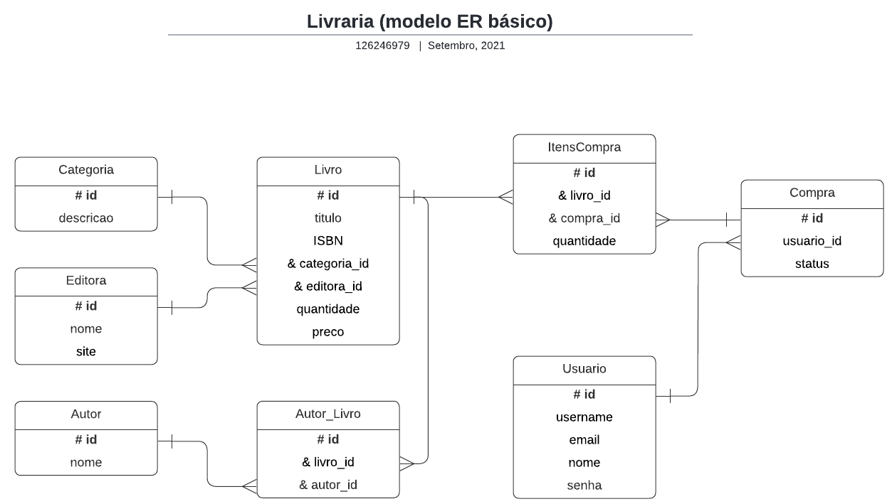
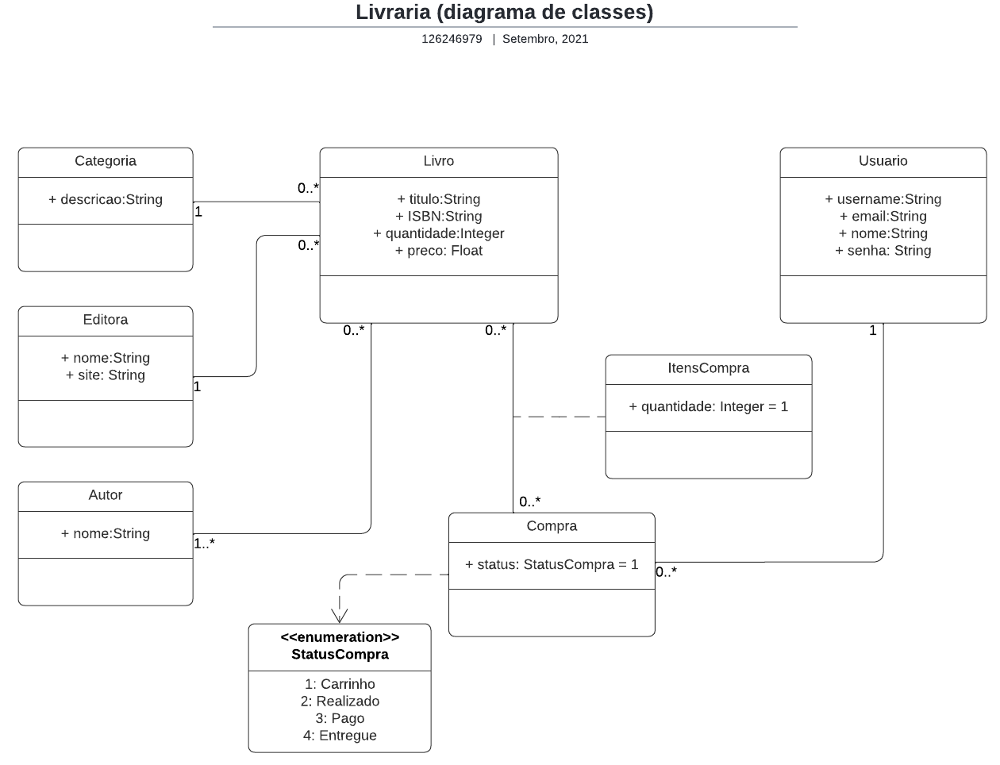
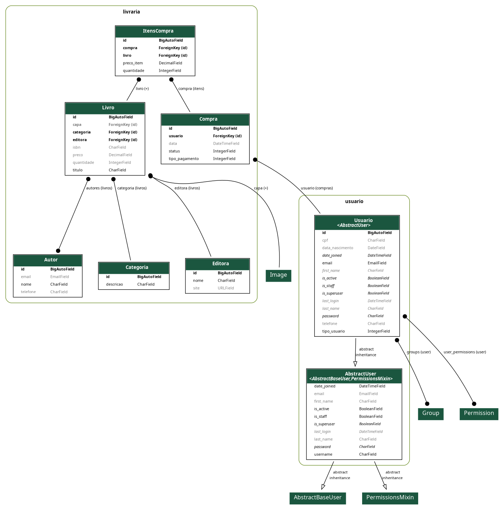
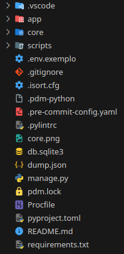

[Início](../../README.md) | [Seção](README.md) | [Anterior](README.md) | [Próxima](02-02-criacao-de-uma-aplicacao.md)

# 2.1 Criação do projeto

## Objetivo da aula

Criar o projeto `livraria` a partir do template adotado no curso e colocá-lo para rodar localmente.

## Introdução

O projeto da livraria será criado a partir de um repositório de template. Isso evita repetir configurações iniciais e permite começar mais rápido a parte de backend com Django e DRF.

## Desenvolvimento

### 1. O projeto Livraria

Este projeto consiste em uma API REST para uma livraria. Ele terá as seguintes classes:

- `Categoria`: representa a categoria de um livro.
- `Editora`: representa a editora de um livro.
- `Autor`: representa o autor de um livro.
- `Livro`: representa um livro.
- `User`: representa um usuário do sistema.
- `Compra`: representa uma compra de livros.
- `ItemCompra`: representa um item de uma compra.

### 2. Modelo entidade relacionamento



### 3. Diagrama de classes



### 4. Modelo de dados do Django



### 5. Criação do projeto a partir de um template

> IMPORTANTE: Vamos criar o projeto `livraria` a partir de um repositório de template. Se você quiser aprender a criar um projeto do zero, acesse o tutorial de 2023.

- Acesse o template em https://github.com/marrcandre/template_django_pdm.
- Clique em `Use this template` e depois em `Create a new repository`.
- Preencha as informações solicitadas:
  - `Owner`: seu usuário no GitHub
  - `Repository name`: `livraria`

### 6. Clonando o projeto

Você pode clonar o projeto de duas formas.

Usando o VS Code:

- Abra o VS Code.
- Clique no ícone de Source Control na barra lateral esquerda.
- Clique no botão `Clone Repository`.
- Digite a URL do repositório do projeto.
- Escolha a pasta onde o projeto será clonado.

Usando o terminal:

```shell
git clone <URL do repositório>
code .
```

O projeto criado ficará assim:



### 7. Instalando as dependências

```shell
pdm install
```

### 8. Criando o arquivo `.env`

- Crie o arquivo `.env` a partir do arquivo `.env.exemplo`.
- Opcionalmente, use o terminal:

```shell
cp .env.exemplo .env
```

### 9. Rodando o servidor de desenvolvimento

```shell
pdm run dev
```

### 10. Acessando o projeto

- Acesse `http://127.0.0.1:8000/admin`.
- Dados de acesso:
  - Usuário: `a@a.com`
  - Senha: `teste.123`

> IMPORTANTE: O servidor de desenvolvimento deve estar sempre rodando para que o projeto funcione.

## Prática

- Apague o projeto e crie novamente seguindo os passos acima.
- Verifique se o projeto está rodando e se o Admin está em execução.
- Observe quais configurações precisaram ser refeitas e quais já vieram prontas.

## Conclusão

Com o projeto criado e funcionando localmente, você já pode começar a entender a estrutura da aplicação que servirá de base para o restante do curso.

## Próxima aula

- [2.2 Criação de uma aplicação](02-02-criacao-de-uma-aplicacao.md)

[Início](../../README.md) | [Seção](README.md) | [Anterior](README.md) | [Próxima](02-02-criacao-de-uma-aplicacao.md)