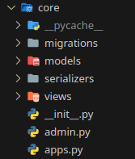

[Início](../../README.md) | [Seção](README.md) | [Anterior](02-01-criacao-do-projeto.md) | [Próxima](02-03-criacao-de-uma-api-rest.md)

# 2.2 Criação de uma aplicação

## Objetivo da aula

Entender a estrutura de uma aplicação Django e criar a primeira model do projeto, a `Categoria`.

## Introdução

No Django, uma aplicação organiza uma funcionalidade específica do sistema. No projeto da livraria, a aplicação principal é `core`.

## Desenvolvimento

### 1. Compreendendo uma aplicação

Uma aplicação no Django é um conjunto de arquivos e pastas que contém o código de uma funcionalidade específica do site.

Uma aplicação pode ser criada dentro de um projeto ou importada de outro projeto.

Em nosso projeto, temos uma aplicação criada, chamada `core`:



> Todas as aplicações precisam ser adicionadas ao arquivo `settings.py` do projeto, na seção `INSTALLED_APPS`.

Dentro da pasta `core`, os itens mais importantes são:

- `migrations`: pasta de migrações de banco de dados (normalmente não é editada diretamente).
- `models`: pasta onde ficam as models (tabelas).
- `serializers`: pasta onde ficam os serializadores (representações dos dados).
- `views`: pasta onde ficam as views (funções que processam as requisições).
- `admin.py`: arquivo de configuração do Admin (interface de administração do Django).

### 2. Model User

Um modelo no Django é uma classe que representa uma tabela no banco de dados. Cada atributo da classe representa um campo da tabela.

Para mais informações, consulte a [documentação do Django sobre models](https://docs.djangoproject.com/en/4.0/topics/db/models/).

> A pasta `models` já contém um modelo chamado `User`, que modifica o usuário padrão do Django e representa um usuário do sistema.

### 3. Criação da model de Categoria

- Crie o arquivo `models/categoria.py`.
- Adicione o seguinte código:

```python
from django.db import models


class Categoria(models.Model):
    descricao = models.CharField(max_length=100)
```

Nesse código, você:

- importou o pacote necessário para criar a model;
- criou a classe `Categoria`;
- incluiu o campo `descricao`, uma string de no máximo 100 caracteres.

> IMPORTANTE:
> - O nome da classe deve ser sempre no singular e com a primeira letra maiúscula.
> - O nome dos campos deve ser sempre no singular e com todas as letras em minúsculo.

### 4. Inclusão da model no `__init__.py`

No arquivo `models/__init__.py`, adicione:

```python
from .categoria import Categoria
```

### 5. Efetivando a criação da tabela

- Abra um novo terminal, deixando o terminal antigo executando o servidor do projeto.
- Crie as migrações:

```shell
pdm run migrate
```

Esse comando executará em sequência:

- `makemigrations` (cria os arquivos de migração);
- `migrate` (aplica as migrações no banco de dados);
- `graph_models` (gera o diagrama de classes atualizado).


### 6. Verifique o resultado:

- Acesse o arquivo do banco de dados (`db.sqlite3`) e verifique se a tabela `core_categoria` foi criada.
- Para ver o diagrama de classes atualizado, acesse o arquivo `core.png` na pasta raiz do projeto.
- Acesse o Admin do projeto e verifique se a nova tabela aparece lá.

### 7. Inclusão no Admin

A tabela ainda não aparecerá enquanto você não a registrar no Admin.

Adicione ao final de `core/admin.py`:

```python
admin.site.register(models.Categoria)
```

### 8. O campo `id`

O campo `id` é criado automaticamente pelo Django. Ele é o identificador único de cada registro da tabela.

### 9. Melhorando a forma de exibição dos registros

Ao cadastrar categorias, você verá algo como `Categoria object (1)`. Para melhorar isso, adicione o método `__str__` na model:

```python
def __str__(self):
    return self.descricao
```

Ou ainda melhor:

```python
def __str__(self):
    return f'({self.id}) {self.descricao}'
```

> O método `__str__` sempre deve retornar uma string.

## Hora do commit

Verifique antes se o seu computador está configurado corretamente para o git com as suas credenciais. Caso não esteja, acesse a seção de [configuração do git](https://github.com/marrcandre/django-drf-tutorial/blob/tutorial_secoes/secoes/10-ferramentas-operacao-e-apoio/10-02-configuracao-do-git.md).

Sugestão de mensagem:

```text
feat(2.2): cria model de categoria
```

## Prática

- Acesse novamente o Admin e inclua algumas categorias no banco de dados.
- Volte ao Admin e observe a diferença na apresentação dos registros após o `__str__`.

## Conclusão

Agora você já compreende a estrutura da aplicação `core` e criou a primeira model do projeto.

## Próxima aula

- [2.3 Criação de uma API REST](02-03-criacao-de-uma-api-rest.md)

[Início](../../README.md) | [Seção](README.md) | [Anterior](02-01-criacao-do-projeto.md) | [Próxima](02-03-criacao-de-uma-api-rest.md)