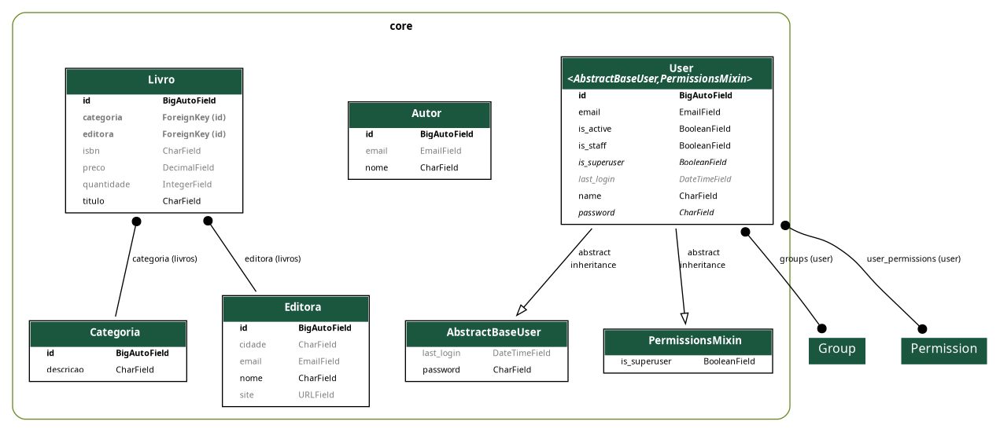

[Início](../../README.md) | [Seção](README.md) | [Anterior](03-03-criacao-da-api-para-livro.md) | [Próxima](03-05-inclusao-do-relacionamento-n-para-n-no-modelo-do-livro.md)

# 3.4 Inclusão das chaves estrangeiras no modelo Livro

## Objetivo da aula

Relacionar `Livro` com `Categoria` e `Editora` usando chaves estrangeiras e compreender os efeitos disso no banco, no Admin e na API.

## Introdução

Até aqui, `Livro` ainda estava isolado. Agora vamos conectá-lo às entidades já criadas, construindo o primeiro conjunto relevante de relacionamentos do domínio.

## Desenvolvimento

### 1. Campo `categoria` no `Livro`

Inclua a linha a seguir no modelo `Livro`, logo após o atributo `preco`:

```python
from .categoria import Categoria

categoria = models.ForeignKey(
    Categoria, on_delete=models.PROTECT, related_name='livros', null=True, blank=True
)
```

Vamos entender cada parte:

- `models.ForeignKey`: define o campo como chave estrangeira;
- `Categoria`: model associada ao campo;
- `on_delete=models.PROTECT`: impede apagar uma categoria que possua livros associados;
- `related_name='livros'`: cria o relacionamento reverso em `Categoria`;
- `null=True, blank=True`: tornam o campo não obrigatório.

### 2. Campo `editora` no `Livro`

Inclua logo em seguida à `categoria`:

```python
from .editora import Editora

editora = models.ForeignKey(
    Editora, on_delete=models.PROTECT, related_name='livros', null=True, blank=True
)
```

Faça a migração dos dados.

> Observe que os campos `categoria_id` e `editora_id` foram criados na tabela `core_livro`, referenciando as tabelas relacionadas.

O modelo ficará assim:



### 3. Testando o atributo `on_delete`

No Admin:

- cadastre categorias, editoras, autores e livros;
- tente apagar uma editora ou categoria com livros associados;
- tente apagar uma editora ou categoria sem livros associados.

Observe o que acontece em cada caso e por quê.

### 4. Testando `related_name` no Django Shell

Abra o Django Shell Plus:

```shell
pdm run shellp
```

Depois:

```python
Categoria.objects.get(id=1).livros.all()
```

## Hora do commit

Sugestão de mensagem:

```text
feat(3.4): inclui relacionamento de livro com categoria e editora
```

## Prática

- Teste o relacionamento no Admin.
- Teste o relacionamento reverso no shell.
- Analise o efeito do `PROTECT` nos testes de exclusão.

## Conclusão

Com essas chaves estrangeiras, `Livro` deixa de ser um recurso isolado e passa a refletir melhor o domínio da livraria.

## Próxima aula

- [3.5 Inclusão do relacionamento n para n no modelo do Livro](03-05-inclusao-do-relacionamento-n-para-n-no-modelo-do-livro.md)

[Início](../../README.md) | [Seção](README.md) | [Anterior](03-03-criacao-da-api-para-livro.md) | [Próxima](03-05-inclusao-do-relacionamento-n-para-n-no-modelo-do-livro.md)