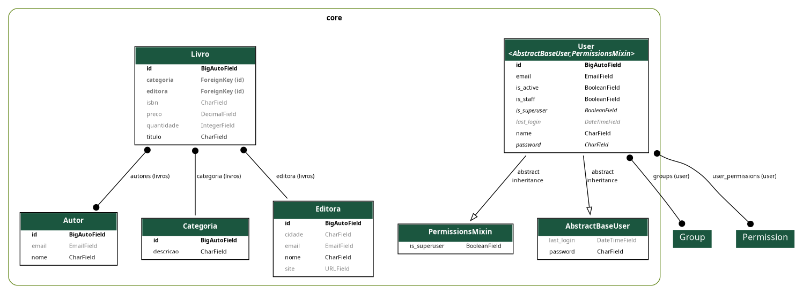

[Início](../../README.md) | [Seção](README.md) | [Anterior](03-04-inclusao-das-chaves-estrangeiras-no-modelo-livro.md) | [Próxima](03-06-modificacao-da-api-para-livro.md)

# 3.5 Inclusão do relacionamento n para n no modelo do Livro

## Objetivo da aula

Criar o relacionamento muitos-para-muitos entre `Livro` e `Autor` e entender como o Django representa isso no banco de dados.

## Introdução

Um livro pode ter vários autores, e um autor pode escrever vários livros. Esse é o cenário clássico de relacionamento n para n.

## Desenvolvimento

### 1. Model com `ManyToManyField`

Inclua o campo `autores` no modelo `Livro`:

```python
from .autor import Autor

autores = models.ManyToManyField(Autor, related_name='livros', blank=True)
```

Execute as migrações.

> Observe que o campo `autores` não foi criado na tabela `core_livro`. Em vez disso, foi criada uma tabela associativa chamada `core_livro_autores`, contendo os campos `livro_id` e `autor_id`.

> Nesse caso, não é necessário usar `null=True`, pois o `ManyToManyField` já cria uma tabela própria para a associação.

O modelo ficará assim:



Observe também:

- no relacionamento entre `Livro` e `Autor`, há uma ligação n para n;
- no caso de `Livro` com `Categoria` e `Editora`, o relacionamento é n para 1.

## Hora do commit

Mensagem sugerida na nova convenção:

```text
feat(3.5): inclui relacionamento n para n entre livro e autor
```

## Prática

- Teste a API REST de livros com as modificações feitas.
- Faça o Exercício da Garagem para praticar o que foi aprendido até aqui.

## Conclusão

Agora `Livro` já consegue refletir relacionamentos mais realistas e o modelo do domínio fica consideravelmente mais rico.

## Próxima aula

- [3.6 Modificação da API para Livro](03-06-modificacao-da-api-para-livro.md)

[Início](../../README.md) | [Seção](README.md) | [Anterior](03-04-inclusao-das-chaves-estrangeiras-no-modelo-livro.md) | [Próxima](03-06-modificacao-da-api-para-livro.md)