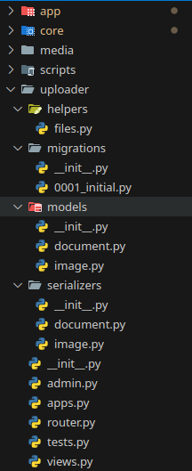
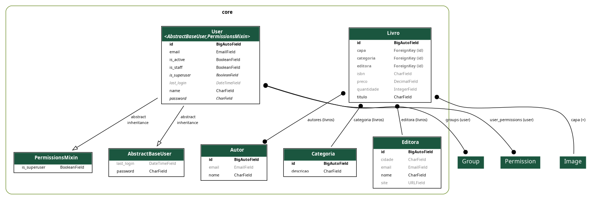

[Início](../../README.md) | [Seção](README.md) | [Anterior](README.md) | [Próxima](04-02-dump-e-load-de-dados.md)

# 4.1 Upload e associação de imagens

## Objetivo da aula

Instalar a aplicação de upload e associar imagens ao modelo `Livro`, incluindo suporte no serializer e na API.

## Introdução

Agora que `Livro` já existe, faz sentido enriquecer a entidade com uma capa. Para isso, vamos incorporar uma aplicação específica de upload de imagens ao projeto.

## Desenvolvimento

### 1. Baixando o pacote

Baixe e descompacte o arquivo com a app pronta para ser utilizada.

No Linux:

```shell
wget https://github.com/marrcandre/django-drf-tutorial/raw/main/apps/uploader.zip -O uploader.zip && unzip uploader.zip && rm -v uploader.zip
```

No Windows, execute os seguintes comandos no PowerShell:

```shell
Invoke-WebRequest -Uri https://github.com/marrcandre/django-drf-tutorial/raw/main/apps/uploader.zip -OutFile uploader.zip
```

```shell
Expand-Archive -Path uploader.zip -DestinationPath .
```

```shell
Remove-Item -Force uploader.zip
```

O projeto ficará com uma estrutura parecida com esta:



### 2. Instalando as dependências

- Remova a pasta `__pypackages__` e o arquivo `pdm.lock`:

```shell
rm -rf __pypackages__ pdm.lock
```

- Recrie o arquivo `pdm.lock`:

```shell
pdm lock
```

- Instale as dependências:

```shell
pdm install
```

### 3. Registro da app e configuração de URLs

Adicione o pacote `uploader` à lista de `INSTALLED_APPS` no `settings.py`:

```python
INSTALLED_APPS = [
    ...
    'uploader',
    'core',
    ...
]
```

No `urls.py`, inclua:

```python
from django.conf import settings
from django.conf.urls.static import static
from uploader.router import router as uploader_router

urlpatterns = [
    ...
    path('api/media/', include(uploader_router.urls)),
    ...
]

urlpatterns += static(settings.MEDIA_ENDPOINT, document_root=settings.MEDIA_ROOT)
```

No `pyproject.toml`, modifique a linha `post_migrate` para incluir a geração do diagrama da app `uploader`.

### 4. Uso em modelos

No arquivo `models/livro.py`, inclua:

```python
from uploader.models import Image


class Livro(models.Model):
    capa = models.ForeignKey(
        Image,
        related_name='+',
        on_delete=models.SET_NULL,
        null=True,
        blank=True,
        default=None,
    )
```

Faça novamente a migração do banco de dados:

```shell
pdm run migrate
```

O modelo ficará assim:



### 5. Uso no serializer

Em `serializers/livro.py`, inclua:

```python
from rest_framework.serializers import ModelSerializer, SlugRelatedField

from uploader.models import Image
from uploader.serializers import ImageSerializer


class LivroRetrieveSerializer(ModelSerializer):
    capa = ImageSerializer(required=False)

    class Meta:
        model = Livro
        fields = '__all__'
        depth = 1


class LivroSerializer(ModelSerializer):
    capa_attachment_key = SlugRelatedField(
        source='capa',
        queryset=Image.objects.all(),
        slug_field='attachment_key',
        required=False,
        write_only=True,
    )
    capa = ImageSerializer(required=False, read_only=True)

    class Meta:
        model = Livro
        fields = '__all__'
```

## Hora do commit

Mensagem sugerida na nova convenção:

```text
feat(4.1): inclui app de upload e associacao de imagens
```

## Prática

- Acesse `http://127.0.0.1:8000/api/media/images/`.
- Faça o upload de uma imagem.
- Guarde o valor de `attachment_key`.
- Crie um livro usando `capa_attachment_key`.
- Verifique se a imagem foi associada corretamente.

## Conclusão

Com a app de upload integrada, o projeto ganha suporte a arquivos e a entidade `Livro` se torna mais próxima de um cenário real.

## Próxima aula

- [4.2 Dump e Load de dados](04-02-dump-e-load-de-dados.md)

[Início](../../README.md) | [Seção](README.md) | [Anterior](README.md) | [Próxima](04-02-dump-e-load-de-dados.md)